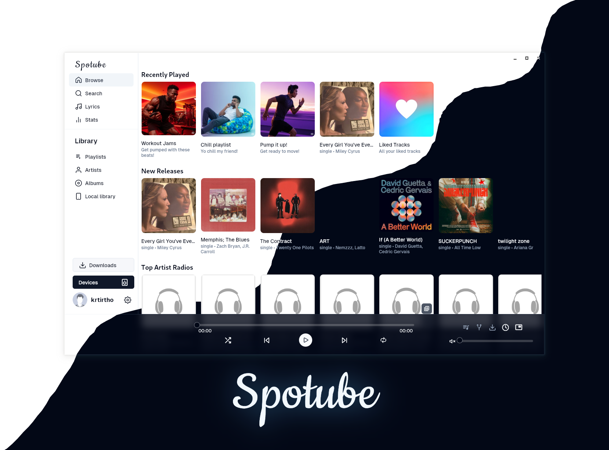
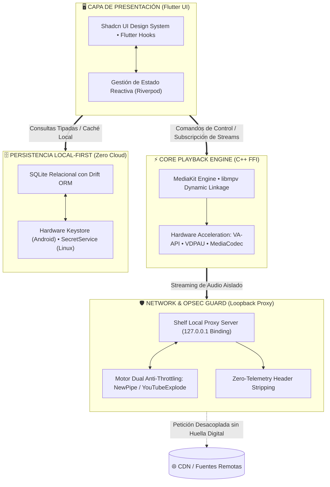
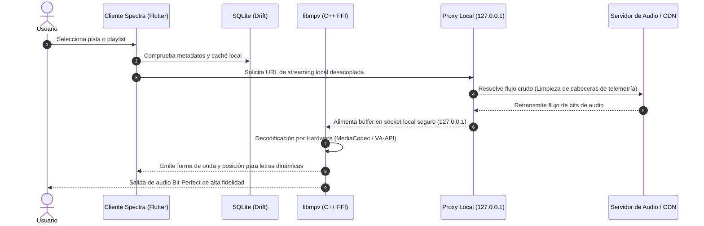

# 🛡️ Spectra — High-Performance Sovereign Music Player

<div align="center">


### *Reproductor y agregador multimedia de alta fidelidad, diseñado bajo el principio de privacidad desde el diseño (Privacy by Design), decodificación nativa acelerada por hardware y soberanía total sobre los datos.*

<br/>

[](https://github.com/rodrigo47363/spectra/releases)
[](LICENSE)
[](#-descargas-y-binarios)
[](PRIVACY_POLICY.md)
[](https://mpv.io)
[](https://flutter.dev)

<br/>

[🚀 Descargas](#-descargas-y-binarios) • [⚖️ Comparativa](#%EF%B8%8F-manifiesto-y-comparativa-t%C3%A9cnica) • [✨ Características](#-caracter%C3%ADsticas-de-grado-operativo) • [📱 Vista Previa](#-interfaz-en-acci%C3%B3n) • [🏗️ Arquitectura](#%EF%B8%8F-arquitectura-del-sistema) • [⚙️ Optimización](#%EF%B8%8F-optimizaci%C3%B3n-y-ajustes-de-rendimiento) • [🛠️ Compilación](#-compilaci%C3%B3n-desde-fuente) • [❓ FAQ](#-preguntas-frecuentes-faq) • [👨‍💻 Autor](#-arquitecto-y-desarrollo)

<br/>

</div>

---

## 📱 Interfaz en Acción

<div align="center">

### Experiencia Móvil Adaptativa (Android)


<br/><br/>

### Experiencia de Escritorio (Linux / Windows)


*Interfaz moderna minimalista inspirada en Shadcn UI: extracción cromática adaptativa en tiempo real basada en la portada del álbum.*

</div>

---

## 📌 Visión del Proyecto

**Spectra** es una estación de reproducción de medios multiplataforma que resuelve la degradación actual de los reproductores comerciales: suscripciones obligatorias, publicidad invasiva, perfiles de comportamiento (*fingerprinting*) y aplicaciones infladas construidas sobre navegadores embebidos que consumen gigabytes de memoria RAM.

Construido combinando la agilidad visual de **Flutter** con la potencia de decodificación nativa de **C++ (`libmpv`)**, Spectra opera bajo el paradigma **BYOMM (*Bring Your Own Music Metadata*)**: desacopla completamente el motor de reproducción de las fuentes de datos, permitiendo explorar, organizar y reproducir música en alta fidelidad sin ceder tu identidad a intermediarios comerciales.

---

## ⚖️ Manifiesto y Comparativa Técnica

> [!IMPORTANT]
> **Privacidad Radical:** Spectra no posee servidores de telemetría, no vende analíticas a anunciantes y no requiere cuentas obligatorias. Tus listas de reproducción, historial y llaves residen únicamente en tu dispositivo.

| Métrica / Capacidad | Clientes Comerciales (Spotify, etc.) | Clientes Basados en Electron | 🛡️ Spectra Player |
| :--- | :---: | :---: | :---: |
| **Publicidad e Interrupciones** | ❌ Frecuente (comerciales de audio) | ⚠️ Depende de la fuente | ✅ **0% Publicidad. Siempre.** |
| **Consumo de Memoria RAM** | ⚠️ ~350 MB – 800 MB | ❌ ~600 MB – 1.4 GB | ⚡ **~65 MB – 120 MB (Nativo C++)** |
| **Tiempo de Inicio en Frío** | ⚠️ ~3.5 s – 6.0 s | ❌ ~4.0 s – 8.0 s | ⚡ **< 0.8 s (AOT Compilado)** |
| **Telemetría & Huella Digital** | ❌ Rastrean clics, pausas y hardware | ⚠️ Telemetría de Chromium embebido | 🔒 **Cero telemetría verificada** |
| **Descarga Offline Libre** | ❌ Archivos cifrados con DRM | ❌ No soportado / Incompleto | ✅ **Audio libre con ID3 tags incrustados** |
| **Motor de Audio** | ⚠️ Decodificadores web cerrados | ⚠️ WebAudio API / HTML5 Audio | 🚀 **`libmpv` Nativo (Bit-Perfect)** |
| **Aceleración por Hardware** | ⚠️ Parcial | ⚠️ Inestable / Alto consumo térmico | ✅ **VA-API / VDPAU / MediaCodec** |

---

## 📦 Descargas y Binarios

Binarios oficiales firmados, listos para producción y libres de intermediarios:

| Plataforma | Arquitectura | Formato de Paquete | Enlace de Descarga Directa |
| :--- | :---: | :---: | :--- |
| **Android** | `arm64-v8a`, `armeabi-v7a`, `x86_64` | APK Universal | [📥 **Descargar Spectra-v1.0.0.apk**](https://github.com/rodrigo47363/spectra/releases/download/v1.0.0/Spectra-v1.0.0-android-universal.apk) |
| **Linux (Debian/Ubuntu/Mint/Parrot)** | `x86_64 / amd64` | Paquete `.deb` | [📥 **Descargar Spectra-v1.0.0.deb**](https://github.com/rodrigo47363/spectra/releases/download/v1.0.0/Spectra-v1.0.0-linux-x86_64.deb) |
| **Linux (Universal)** | `x86_64 / amd64` | Tarball Portable (`.tar.gz`) | [📥 **Descargar Bundle Portable**](https://github.com/rodrigo47363/spectra/releases/download/v1.0.0/Spectra-v1.0.0-linux-x86_64.tar.gz) |
| **Windows 10 / 11** | `x86_64` | Instalador / CLI | [🛠️ **Compilar vía CLI**](#3-entorno-windows) • [Ver Releases](https://github.com/rodrigo47363/spectra/releases/tag/v1.0.0) |

<details>
<summary><b>🔐 Verificación Criptográfica de Integridad (SHA-256)</b></summary>
<br/>

Para garantizar que los binarios no han sido alterados en tránsito, verifica sus firmas hash contra el archivo oficial [`SHA256SUMS.txt`](https://github.com/rodrigo47363/spectra/releases/download/v1.0.0/SHA256SUMS.txt):

```bash
# Descargar archivo de firmas y verificar automáticamente
curl -sLO https://github.com/rodrigo47363/spectra/releases/download/v1.0.0/SHA256SUMS.txt
sha256sum --check SHA256SUMS.txt --ignore-missing
```

| Archivo | Hash SHA-256 Oficial |
| :--- | :--- |
| `Spectra-v1.0.0-android-universal.apk` | `d765babbab3fa0f178205bcbff70c8c63a47045e0db590e54b2d1d5cdd4e706a` |
| `Spectra-v1.0.0-linux-x86_64.deb` | `cc1ab158a6b8432af407a7d1f9ad8f9d82600aa22a34f4b17e4f5363f15590f0` |
| `Spectra-v1.0.0-linux-x86_64.tar.gz` | `ef528bfa3035adb15a2988be0752f32e3b835afbaeb300c368f9e46447d8e3ea` |
</details>

> 🌐 *Repositorio de binarios históricos y tags de versión: [GitHub Releases v1.0.0](https://github.com/rodrigo47363/spectra/releases/tag/v1.0.0)*

---

## 🚀 Despliegue Rápido (Instalación en 1 Minuto)

<details open>
<summary><b>📱 En Android (Instalación limpia sin tiendas invasivas)</b></summary>
<br/>

1. Descarga el paquete oficial: [Spectra-v1.0.0.apk](https://github.com/rodrigo47363/spectra/releases/download/v1.0.0/Spectra-v1.0.0-android-universal.apk).
2. Toca la notificación de descarga en tu dispositivo y concede permiso para instalar desde el navegador si el sistema lo solicita.
3. Presiona **Instalar** y disfruta tu música.

> [!TIP]
> **Audio continuo con pantalla bloqueada:** En *Ajustes de Android > Aplicaciones > Spectra > Batería*, selecciona **"Sin restricciones"** (o deshabilita el ahorro de energía para la app). Esto previene que el kernel de Android suspenda el socket loopback local mientras la pantalla está apagada.
</details>

<details>
<summary><b>🐧 En Linux (Script One-Liner multiautomatizado o vía APT)</b></summary>
<br/>

**Opción A — Vía terminal con APT:**
```bash
wget https://github.com/rodrigo47363/spectra/releases/download/v1.0.0/Spectra-v1.0.0-linux-x86_64.deb
sudo apt install -y ./Spectra-v1.0.0-linux-x86_64.deb
```

**Opción B — Instalador inteligente multienlace (Debian, Arch, Fedora, openSUSE):**
```bash
curl -sSL https://raw.githubusercontent.com/rodrigo47363/spectra/main/scripts/install.sh | sudo bash
```
</details>

<details>
<summary><b>💻 En Windows 10 / 11</b></summary>
<br/>

1. Consulta los binarios disponibles en [Releases](https://github.com/rodrigo47363/spectra/releases/tag/v1.0.0) o compila el instalador nativo directamente mediante el CLI del proyecto:
   ```bash
   dart run cli/cli.dart build windows
   ```
2. El archivo `.exe` empaquetado con Inno Setup se generará en `dist/Spectra-windows-x86_64-setup.exe`.
3. Ejecuta el instalador y sigue el asistente interactivo.
</details>

---

## 🌟 Características de Grado Operativo

* 🔒 **Soberanía y Zero-Telemetry:** Ausencia certificada de SDKs publicitarios, identificadores únicos de dispositivo (IMEI/Android ID/GUID), análisis de telemetría de red o rastreadores analíticos en segundo plano.
* ⚡ **Pipeline Nativo C++ (`libmpv`):** Vinculación directa mediante FFI (*Foreign Function Interface*) con las librerías dinámicas de `mpv`. Permite reproducción *bit-perfect*, control de ganancia ReplayGain y latencia de búfer inferior a 15 ms.
* 🛡️ **Proxy Local Blindado en Loopback (`127.0.0.1`):** Servidor HTTP local embebido (*Shelf*) confinado a la interfaz local. Aísla las peticiones de streaming, elimina cabeceras que delaten el dispositivo y previene fugas de metadatos en redes públicas.
* 🔄 **Conmutación Dual Anti-Throttling:** Soporte alternable entre motores de extracción en caliente (**NewPipe Extractor** y **YouTubeExplode**) para evadir restricciones de velocidad (*rate limiting*) en orígenes remotos.
* 📥 **Gestor de Descargas con Tagging ID3 Completo:** Descarga canciones y álbumes en alta calidad con carátulas incrustadas y metadatos estándar (título, artista, año, género, número de pista).
* 🎤 **Letras Sincronizadas (Modo Karaoke):** Sincronización lírica dinámica y fluida en tiempo real integrada en el panel de reproducción.
* 🎨 **Interfaz Reactiva Shadcn UI:** UI ligera basada en Flutter Hooks y Riverpod, con extracción adaptativa de paleta de colores derivada dinámicamente de cada portada musical.
* 🗄️ **Almacenamiento Local-First Cifrado:** Base de datos relacional ultrarrápida en **SQLite con Drift ORM**. Las credenciales y claves de sesión se custodian en los almacenes cifrados nativos del sistema operativo (`libsecret` en Linux y `EncryptedSharedPreferences` con respaldo en Keystore por hardware en Android).

---

## 🏗️ Arquitectura del Sistema



### 🔁 Secuencia de Reproducción Segura



---

## ⚙️ Optimización y Ajustes de Rendimiento

Para exprimir al máximo la eficiencia energética y la calidad acústica:

### 📱 Ajustes Críticos en Android:
1. **Códec Recomendado (`m4a` / AAC):**
   * En *Ajustes > Reproducción*, selecciona **`m4a`**. Esto activa la decodificación por hardware nativo en el silicio del dispositivo (*MediaCodec*), manteniendo la CPU en estados de bajo consumo (*C-States*) y reduciendo drásticamente el gasto de batería frente a la decodificación por software de formatos OPUS.
2. **Alternancia de Motor de Extracción:**
   * Si la reproducción sufre congelamientos por estrangulamiento de IP de las CDNs de origen, cambia entre **NewPipe** y **YouTubeExplode** en *Ajustes*. El cambio restablece el endpoint inmediatamente.
3. **Optimización de Batería (Doze Mode Bypass):**
   * Asigna **"Sin restricciones"** a Spectra en la gestión de batería del sistema para evitar que el socket `127.0.0.1` sea cerrado cuando el teléfono entra en reposo profundo.

### 🐧 Ajustes Críticos en Linux:
* Asegúrate de tener instaladas las librerías dinámicas `libmpv-dev` o `mpv` y los controladores de aceleración por video correspondientes a tu GPU (`intel-media-va-driver`, `mesa-va-drivers` o `nvidia-vaapi-driver`).

---

## 🛠️ Compilación desde Fuente

Guía hermética para compilar binarios reproducibles en tu propio entorno:

### 1. Entorno Linux (Debian, Ubuntu, Parrot OS, Kali)

Instalar dependencias de compilación del sistema:
```bash
sudo apt update
sudo apt install -y build-essential libgtk-3-dev libmpv-dev libsecret-1-dev \
    libnotify-dev libjsoncpp-dev libwebkit2gtk-4.1-dev libsoup-3.0-dev mpv
```

Compilar binario optimizado de producción:
```bash
./build_optimized.sh
```
*Binario generado en:* `build/linux/x64/release/bundle/spectra`

Empaquetar instalador debian estándar:
```bash
./scripts/package_deb.sh
```
*Paquete generado en:* `dist/Spectra-v1.0.0-linux-x86_64.deb`

---

### 2. Entorno Android

**Requisitos:** Android SDK (API 34+), JDK 17+ y Flutter SDK (3.29.0+).

```bash
# Limpiar entorno y construir APK firmado para producción
flutter clean
flutter pub get
flutter build apk --flavor stable
```
*Ubicación del paquete:* `build/app/outputs/flutter-apk/app-stable-release.apk`

---

### 3. Entorno Windows

**Requisitos:** Visual Studio 2022 (*Desktop development with C++*) e Inno Setup 6.

```bash
dart run cli/cli.dart build windows
```
*Ubicación del instalador:* `dist/Spectra-windows-x86_64-setup.exe`

---

## 🔄 Automatización de Versiones (DevOps)

Spectra incorpora un gestor automatizado de versiones semánticas para agilizar el ciclo de despliegue:

```bash
# Consultar versión actual del proyecto
./scripts/bump_version.sh show

# Incrementar versión de parche (1.0.0 -> 1.0.1)
./scripts/bump_version.sh patch

# Incrementar versión menor y etiquetar en git (1.0.0 -> 1.1.0)
./scripts/bump_version.sh minor --tag

# Asignar versión explícita con build number
./scripts/bump_version.sh set 1.2.0 5 --tag
```

---

## ❓ Preguntas Frecuentes (FAQ)

<details>
<summary><b>¿Necesito pagar una cuenta o suscripción para usar Spectra?</b></summary>
<br/>
<b>No, nunca.</b> Spectra es un software completamente libre y de código abierto. No existen modalidades "Premium", pagos recurrentes ni límites arbitrarios en la reproducción o salto de pistas.
</details>

<details>
<summary><b>¿De dónde provienen los flujos de audio y cómo es legal?</b></summary>
<br/>
Spectra opera bajo el paradigma BYOMM. La aplicación desacopla los metadatos de las pistas y resuelve el audio en crudo a través de motores de extracción abiertos (como NewPipe). No aloja ni distribuye archivos en servidores propios; actúa como un cliente descentralizado gobernado exclusivamente por el usuario.
</details>

<details>
<summary><b>¿Por qué Spectra no se distribuye en Google Play Store?</b></summary>
<br/>
Las directivas comerciales de Google prohíben explícitamente en su tienda toda aplicación que permita reproducción en segundo plano y descargas sin anuncios de fuentes como YouTube, ya que compite directamente con su modelo publicitario y de suscripción. Distribuirlo directamente en GitHub garantiza neutralidad, código no adulterado y ausencia de rastreadores forzados.
</details>

<details>
<summary><b>¿Es seguro instalar el archivo APK en mi dispositivo?</b></summary>
<br/>
<b>Absolutamente.</b> Al ser un proyecto 100% auditable y de código abierto, cualquiera puede verificar la integridad del código en este repositorio. No contiene adware, librerías de tracking ni spyware de ningún tipo.
</details>

<details>
<summary><b>¿Puedo descargar mi música para escucharla sin conexión?</b></summary>
<br/>
<b>Sí.</b> Spectra integra un gestor de descargas que almacena las pistas en formatos estándar con carátulas, artista y metadatos incrustados listos para reproducir en cualquier momento sin consumir datos móviles.
</details>

---

## 👨‍💻 Arquitecto y Desarrollo

<div align="center">

### **Rodrigo**
*Offensive Security Specialist & Software Architect*

> *"Impacto real > Teoría. Privacidad y rendimiento de grado operativo."*

[](https://github.com/rodrigo47363)
[](https://linkedin.com/in/rodrigo-v-695728215)
[](https://youtube.com/@Rodrigo-47363)
[](mailto:rodrigovil@proton.me)

</div>

---

## ⚡ Apoyo a la Investigación Operativa

Si este proyecto o las herramientas que he desarrollado han aportado valor a tu flujo de trabajo diario, puedes apoyar el desarrollo continuo y la infraestructura mediante donaciones directas:

| Activo Criptográfico | Red Oficial | Dirección de Destino |
| :--- | :---: | :--- |
| **Bitcoin (BTC)** | *BTC Native / SegWit* | `bc1qkzmpd0hry99qms7ef23vsyx9vt34pzzaslpp8y` |
| **Ethereum (ETH)** | *ERC-20 / EVM* | `0xB75bC57C54FCBFF139EBF981A596B019C537d018` |
| **Solana (SOL)** | *SPL Network* | `ELekuGHcmZjhXrtHNqHuu8QmdCZr3oCWtTmu3QUQ5hac` |

---

## 📜 Licencia y Descargo de Responsabilidad

Este software se publica bajo los términos de la licencia **BSD 4-Clause**. Para más detalles, consulta el archivo [LICENSE](LICENSE).

```text
Copyright (c) 2026, Rodrigo. All rights reserved.
Redistribution and use in source and binary forms, with or without modification,
are permitted provided that the conditions in LICENSE are met.
```

**Descargo Legal:** Spectra no aloja, retransmite ni comercializa material protegido por derechos de autor. Todas las consultas de medios y metadatos se resuelven de forma descentralizada y del lado del cliente a través de los plugins y fuentes configurados por el usuario final bajo su propia responsabilidad.

---

<div align="center">

<sub>Desarrollado con rigor técnico y soberanía digital • Diseñado para perdurar.</sub>

</div>
